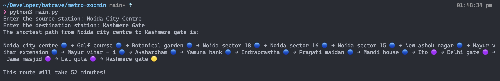

# Metro Zoomin

The goal of this project is to provide a tool that can efficiently find the shortest path between two stations in the delhi metro system. To achieve this, I have implemented the Djikstra's algorithm, which is a popular algorithm for finding the shortest path in a graph.
> Complete list of supported stations [here](assets/station_list.txt)

> 🚧 Disclaimer
>
> This project was initially meant to be in `C` however I contracted Covid this past week and the fastest way to implement a program was using `Python`. I had already confirmed this with Professor tho -- who told me `Python` was ok but `C` is preferred. Apologies for the inconvenience.

## :thinking: How It Works?




The logic for this is in `MetroGraph` class inside `models.py`. The time between stations is used as the weight as between nodes(stations). 
It is implemented using the `Graph` and `PriorityQueue` data structures.

The project has 0 external dependancies and can be run using any system with `Python 3.6 >=`.

You will then be prompted to enter `Source` and `Destination` metro stations, which are then used as inputs in the `get_shortest_path` function.

Incase the source and destination nodes are invalid and/or not in the [stations list](assets/station_list.txt), the program will prompt you to re-enter vaild staition names.


## :computer: Installing Locally

```bash

# clone this repository.
git clone https://github.com/parzuko/metro-zoomin.git
cd metro-zoomin

# run code
python3 main.py
```

---

Made for CS-1203 Data Structures Monsoon 2022 (And For Fun!) :v: [Questions?](https://twitter.com/parzuko)
